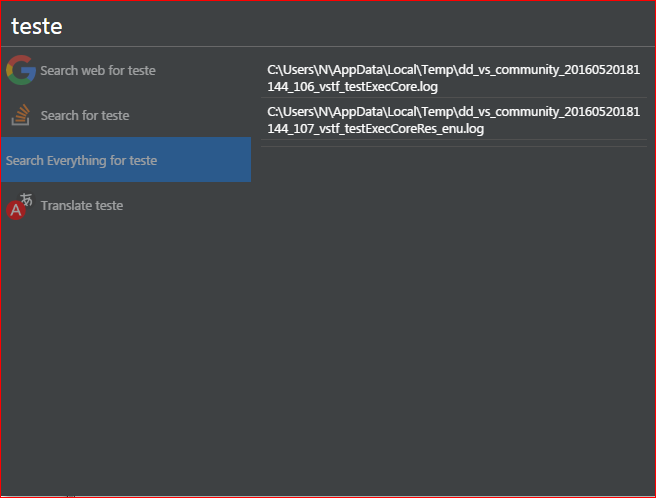
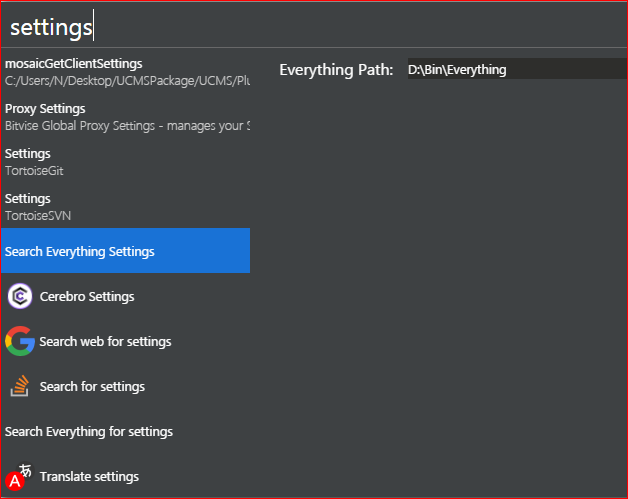

# Cerebro Everything by voidtools interface plugin

Simply adds a tool to search your computer on windows using Everything by voidtools.

This is done by using the es cli available from voidtools.

## Dependencies
* Requires Everything by voidtools - https://www.voidtools.com/
* Requires the ES executable to access the cli - https://www.voidtools.com/support/everything/command_line_interface/

## Known Limitations
* Presentation is not the best
* Only shows 20 results, but this value is fixed

## Related
* [cerebro-stackoverflow](https://github.com/BrainMaestro/cerebro-stackoverflow/) - Used as a source to figure things out
* [Cerebro](http://github.com/KELiON/cerebro) – main repo for Cerebro app
* [cerebro plugin boilerplate](https://github.com/KELiON/cerebro-plugin) – boilerplate used to create this plugin
